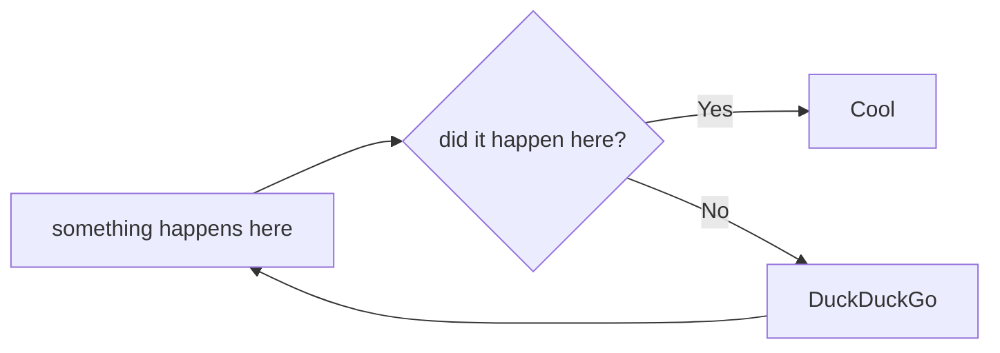

More info:
http://thinkrelevance.com/blog/2011/11/15/documenting-architecture-decisions

# Short title
A to the point short title should be used for each ADR preferably in the form of a question.
 
e.g. Should we reinvent HTML?

# Status
A clear status of the ADR. Team should adopt whatever statuses work for them but it is recommended to start with a simple OPEN or CLOSED. A binary type of status ensures decisions get made!

e.g.
OPEN

# Context
Outline the context or background as to why this ADR is required.

e.g. We feel that the web is broken and HTML does not serve our purpose for structuring pages served by web browsers. A new technology is needed so we will evaluate the offerings against the dinosaur that is HTML.*

# Options
A list or bullets of options for consideration try to aim for 3 or more. Link to resources/references to enable the team to contribute to the discussion if they do not know the tech options. This list should be MECE (Mutually Exclusive Collectively Exhaustive) in approach https://en.wikipedia.org/wiki/MECE_principle.

e.g.
- HTML
- HAML
- AXR

# Decision
Always ensure a ADR has a decision listed even if the status is OPEN. This promotes progression of discussion.
e.g. 
HTML

# Rationale
Outline the pros and cons for the decision taken. Be sure to outline why the options that are not the decision were ruled out. Use this space to be clear if this ADR should be reviewed in future.
Format should be bullets or list form again.

e.g. 
Guess it works

# Dependencies
A list or bullets of key dependencies on being able to proceed with the decision outlined above.

e.g. 
Requires Architecture Review Board sign off

# Impact
Outline what the impact is of adopting this decision is on the people, processes and technology both within and external to the team.

e.g. 
New way of working for the team requires training

# Contributors
List who has contributed to the decision outcome of this ADR

e.g.
- Chris Oram
- Steve Leighton
- Tim Berners-Lee

# Supporting Info (optional)
Add any supporting references, diagrams, snippets etc that support this ADR.

e.g. 
https://www.w3.org/

