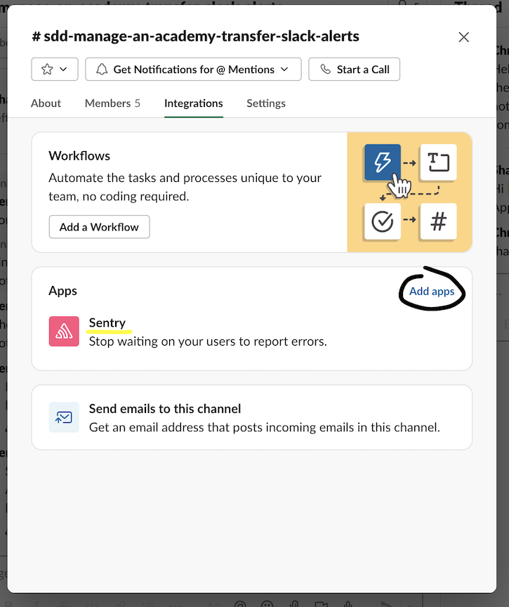

# How to set up Sentry

[Sentry](https://sentry.io/) is a SaaS product providing error reporting and application performance monitoring (APM) functionality.

## Sentry organisation

We have currently have one Sentry license which can be used by all teams within SDD. This means that all quotas (error samples, data storage, events) are shared across the teams in SDD.

Projects will be used to represent individual applications or APIs. Environments exist within projects.

Sentry will be used in preference to Application Insights for Azure-hosted components, so that there exists a single tool for error reporting and APM functionality (single pane of glass) across SDD.

## 1. Creating a Sentry team and project

Follow [this guide](https://docs.sentry.io/product/accounts/getting-started/#2-set-up-teams) to create a team for your SDD team, if it doesn't exist already.

Next [create a project](https://docs.sentry.io/product/sentry-basics/guides/integrate-frontend/create-new-project/), selecting the following options:

* Platform: `ASP.NET Core`
* Set your default alert settings: `Alert me on every new issue`

We set up alerts in this way initially so that we don't miss any, then tweak the settings iteratively as we learn what is 'normal' for our service - what we do and what we don't need to care about.

## 2. Adding Sentry to your ASP.NET Core application

Integrating Sentry is relatively simple, requiring changes only to NuGet refereces, `Startup.cs` and `Program.cs`. If Serilog is used there is an additional step.

### Core App Integration

Add the ASP Net Core Sentry NuGet package:

```
dotnet add package Sentry.AspNetCore --version 3.10.0
```

Modify your `Program.cs` to include the parameterless call to `UseSentry()`:

```csharp
        public static IHostBuilder CreateHostBuilder(string[] args) =>
            Host.CreateDefaultBuilder(args)
                .UseSerilog()
                .ConfigureWebHostDefaults(webBuilder =>
                {
                    // Add the following line:
                    webBuilder.UseSentry();
                    webBuilder.UseStartup<Startup>();
                    webBuilder.UseKestrel(options =>
                    {
                        options.AddServerHeader = false;
                    });
                });
```

Enable Sentry middleware for performance monitoring - add a call to `app.UseSentryTracing()` in  `Configure(...)` within `Startup.cs`. Make sure to add it right after `app.UseRouting()` as instructed in [this guide](https://docs.sentry.io/platforms/dotnet/guides/aspnetcore/performance/instrumentation/automatic-instrumentation/).

### Serilog Integration

If Serilog is used (it is recommended for Logit.io structured logging), then we need to add an additional package:

```powershell
dotnet add package Sentry.Serilog --version 3.10.0
```

And modify the `Program.cs` file, adding the 6th line below:

```csharp
        public static void Main(string[] args)
        {
            Log.Logger = new LoggerConfiguration()
                .MinimumLevel.Override("Microsoft", LogEventLevel.Information)
                .Enrich.FromLogContext()
                .WriteTo.Console(new RenderedCompactJsonFormatter())
                .WriteTo.Sentry()
                .CreateLogger();

            Log.Information("Starting web host");
            CreateHostBuilder(args).Build().Run();
        }
```

This configures Serilog integration with the defaults, which are sensible for us.

## 3. Configuring Alerts

It's recommended to set up alerting to route to both e-mail and a Slack channel, using the following convention for the Slack channel name: 

```sdd-<service name>-slack-alerts```

The Slack channel is typically the same one used for your StatusCake alerts.

### Adding Slack integration

This [guide](https://docs.sentry.io/product/integrations/notification-incidents/slack/) covers setting up the Slack integration, which is already done for the DfE workspace.

Go to the alerts Slack channel created previously, click the title and in the window that appears, browse to the Integrations tab. Click 'Add apps' and add the Sentry app to the channel - you should see a message in the channel that Sentry has joined.



At this point we recommend [linking Team notifications](https://docs.sentry.io/product/integrations/notification-incidents/slack/#team-notifications) by sending the command `/sentry link team` and linking the Sentry team to the Slack channel.

### Setting up alerts

Follow the [remaining steps in the Sentry Slack integration guide](https://docs.sentry.io/product/integrations/notification-incidents/slack/#alert-rules) to add Slack as a destination for your alerting.

# Iterating on the configuration

This initial set up guide has not focussed on the alerting setup in much detail. This is intentional as correct alerting levels and critera are specific to each application.

The general guidance is to set alerting to maximum sensitivity, and then constantly improve the understanding within the team of what 'correct' looks like. The aim is to avoid noise / alert fatigue without missing out on any genuine alerts.

An approach within your team may be to adopt a zero-tolerance policy to errors. If possible this is a good place to be as long as work fixing errors does not consume too much engineering time.

An alternative is to accept a certain 'baseline' of errors and to tweak alerting to only report if this is exceeded by a certain percentage.

Whichever the approach, as new functionality is added, the team will need to monitor their alerts and adapt.